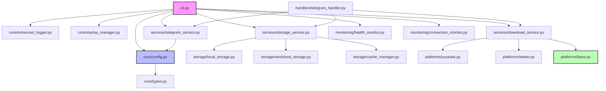
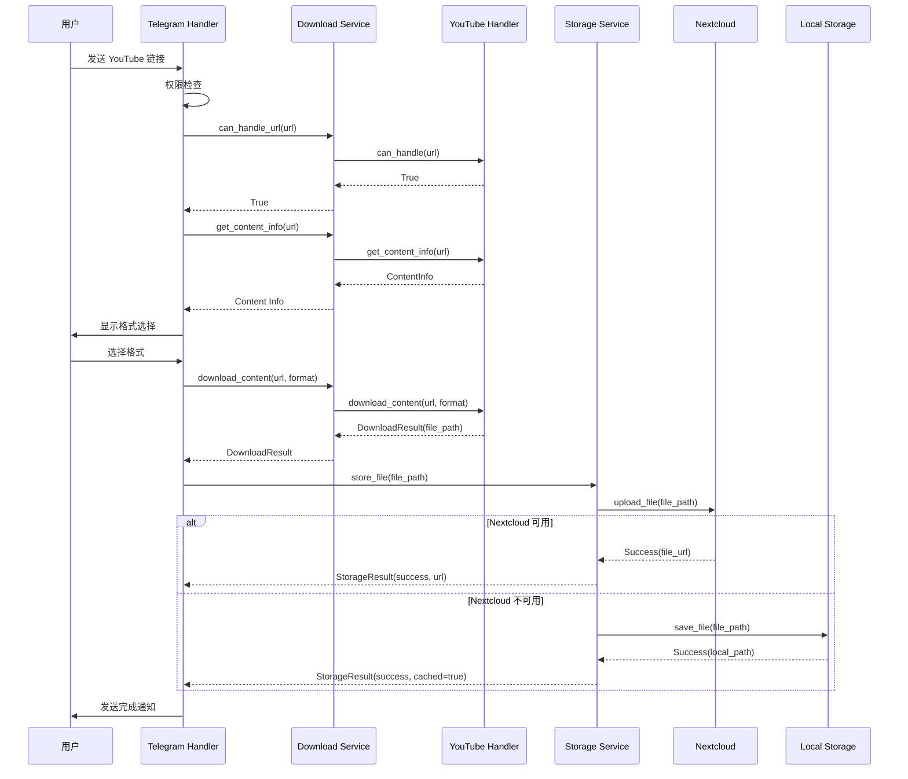

# YTBot 架构设计与代码质量分析报告

**分析日期**: 2026-04-18
**项目版本**: v2.5.0
**分析范围**: 全栈代码审查与架构评估

---

## 目录

1. [项目概述](#1-项目概述)
2. [整体架构设计](#2-整体架构设计)
3. [模块化设计分析](#3-模块化设计分析)
4. [核心模块深度解析](#4-核心模块深度解析)
5. [代码质量评估](#5-代码质量评估)
6. [交互流程分析](#6-交互流程分析)
7. [消息准确性评估](#7-消息准确性评估)
8. [稳定性与兼容性分析](#8-稳定性与兼容性分析)
9. [发现的问题与风险](#9-发现的问题与风险)
10. [改进建议](#10-改进建议)
11. [总结](#11-总结)

---

## 1. 项目概述

### 1.1 项目定位
YTBot 是一个基于 Python 的多平台内容下载和管理机器人，主要功能包括：
- **YouTube 视频/音频下载**：支持多种格式选择和质量控制
- **Twitter/X 内容提取**：使用 Playwright 绕过反爬虫机制
- **Telegram Bot 交互**：提供友好的命令行界面和消息处理
- **多存储后端**：支持本地存储和 Nextcloud 云存储
- **系统监控**：实时监控系统健康状态

### 1.2 技术栈
```
核心框架: Python 3.8+ (asyncio 异步编程)
Telegram: python-telegram-bot >= 20.0
下载引擎: yt-dlp >= 2026.2.4
浏览器自动化: Playwright >= 1.58.0
云存储: webdavclient3 == 3.14.6
配置管理: python-dotenv, dataclass (frozen)
日志系统: logging + 自定义增强
进程管理: filelock, psutil
```

### 1.3 项目结构
```
ytbot/
├── core/                    # 核心基础设施层
│   ├── config.py           # 配置管理（frozen dataclass）
│   ├── types.py            # 类型定义（Protocol, Enum, dataclass）
│   ├── exceptions.py       # 层次化异常体系
│   ├── enhanced_logger.py  # 增强日志系统
│   ├── user_state.py       # 用户状态管理
│   ├── process_lock.py     # 进程锁（防止多实例）
│   └── startup_manager.py  # 启动流程管理
├── platforms/               # 平台处理层
│   ├── base.py             # 抽象基类（PlatformHandler）
│   ├── youtube.py          # YouTube 处理器
│   └── twitter.py          # Twitter/X 处理器
├── services/                # 服务层
│   ├── telegram_service.py # Telegram 服务（单例模式）
│   ├── download_service.py # 下载服务（平台调度）
│   └── storage_service.py  # 存储服务（统一接口）
├── handlers/                # 消息处理器
│   └── telegram_handler.py # Telegram 命令/消息处理
├── monitoring/              # 监控系统
│   ├── health_monitor.py   # 系统健康监控
│   └── connection_monitor.py # 连接状态监控
├── storage/                 # 存储后端
│   ├── local_storage.py    # 本地存储实现
│   ├── nextcloud_storage.py # Nextcloud 实现
│   └── cache_manager.py    # 缓存队列管理
└── utils/                   # 工具模块
    ├── common.py           # 通用工具函数
    └── async_utils.py      # 异步工具函数
```

---

## 2. 整体架构设计

### 2.1 架构模式

YTBot 采用 **分层架构（Layered Architecture）** + **事件驱动（Event-Driven）** 的混合模式：

```
┌─────────────────────────────────────────────────────────────┐
│                     表现层 (Presentation)                      │
│              Telegram Handler / CLI Interface                 │
├─────────────────────────────────────────────────────────────┤
│                       业务逻辑层 (Business)                     │
│         Download Service / Storage Service / State Manager    │
├─────────────────────────────────────────────────────────────┤
│                      平台适配层 (Platform)                      │
│        YouTube Handler / Twitter Handler / Platform Manager   │
├─────────────────────────────────────────────────────────────┤
│                      基础设施层 (Infrastructure)                │
│   Config / Logger / Exceptions / Process Lock / Monitoring    │
└─────────────────────────────────────────────────────────────┘
```

### 2.2 核心设计原则

#### ✅ 优点

1. **单一职责原则（SRP）**
   - 每个模块职责清晰：`config.py` 只负责配置，`types.py` 只负责类型定义
   - 平台处理器独立封装：YouTube 和 Twitter 互不干扰

2. **开闭原则（OCP）**
   - 通过 `PlatformHandler` 抽象基类，新增平台只需继承并实现接口
   - 存储后端可扩展：LocalStorage 和 Nextcloud 实现统一接口

3. **依赖倒置原则（DIP）**
   - 使用 Protocol 定义接口契约（[types.py:106-175](file:///Users/horsenli/Works/ytbot/ytbot/core/types.py#L106-L175)）
   - 高层模块依赖抽象，不依赖具体实现

4. **配置驱动**
   - 所有配置通过环境变量注入，支持 frozen dataclass 保证不可变性
   - 配置验证机制完善（[config.py:262-286](file:///Users/horsenli/Works/ytbot/ytbot/core/config.py#L262-L286)）

#### ⚠️ 待改进

1. **部分模块耦合度较高**
   - `telegram_handler.py` 直接实例化 `YTBot` 获取状态（[telegram_handler.py:121-123](file:///Users/horsenli/Works/ytbot/ytbot/handlers/telegram_handler.py#L121-L123)），应通过依赖注入

2. **全局状态使用过多**
   - `CONFIG` 全局变量在多处直接访问，不利于测试和模块化

---

## 3. 模块化设计分析

### 3.1 模块划分合理性评分：⭐⭐⭐⭐☆ (4/5)

#### 优秀的模块化实践

**1. 核心基础设施层（core/）**

```python
# config.py - 使用 frozen dataclass 实现不可变配置
@dataclass(frozen=True)
class TelegramConfig:
    token: str = field(default_factory=lambda: get_env_str("TELEGRAM_BOT_TOKEN"))
    admin_chat_id: str = field(default_factory=lambda: get_env_str("ADMIN_CHAT_ID"))
```

**优势**：
- ✅ 使用 `frozen=True` 防止运行时修改
- ✅ 类型安全的配置访问
- ✅ 支持默认值和环境变量覆盖
- ✅ 内置验证机制（`validate()` 方法）

**2. 平台适配层（platforms/）**

```python
# base.py - 抽象基类定义统一接口
class PlatformHandler(ABC):
    @abstractmethod
    def can_handle(self, url: str) -> bool: ...
    
    @abstractmethod
    async def download_content(self, url: str, ...) -> DownloadResult: ...
```

**优势**：
- ✅ 清晰的抽象层次
- ✅ 易于扩展新平台
- ✅ 统一的错误处理接口

**3. 异常体系设计（exceptions.py）**

```python
# 层次化的异常体系
YTBotError (基类)
├── ConfigError
│   ├── ConfigValidationError
│   ├── ConfigTypeError
│   └── ConfigMissingError
├── PlatformError
│   ├── YouTubeError
│   ├── TwitterError
│   └── UnsupportedURLError
├── DownloadError
│   ├── DownloadCancelledError
│   ├── DownloadTimeoutError
│   └── FormatSelectionError
└── ... (更多子类)
```

**优势**：
- ✅ 异常分类清晰，便于精准捕获
- ✅ 支持错误码和详细信息
- ✅ 提供用户友好的错误消息转换（`get_user_friendly_message()`）

### 3.2 模块间依赖关系图

```
cli.py
  ├── core/config.py ←── core/types.py
  ├── core/enhanced_logger.py
  ├── core/startup_manager.py
  ├── services/
  │   ├── telegram_service.py ←── core/config.py
  │   ├── download_service.py ←── platforms/base.py
  │   └── storage_service.py ←── storage/
  │       ├── local_storage.py
  │       └── nextcloud_storage.py
  ├── handlers/telegram_handler.py ←── services/*
  └── monitoring/
      ├── health_monitor.py
      └── connection_monitor.py
```

**依赖关系评价**：
- ✅ 核心模块无循环依赖
- ⚠️ `handlers` 层对 `cli.py` 有反向依赖（应解耦）

---

## 4. 核心模块深度解析

### 4.1 配置管理系统（config.py）

**设计亮点**：

1. **类型安全的配置访问**
```python
@dataclass(frozen=True)
class BotConfig:
    telegram: TelegramConfig
    nextcloud: NextcloudConfig
    download: DownloadConfig
    # ... 更多配置组
```

2. **灵活的环境变量解析**
```python
def get_env_int(env_name: str, default: int = 0, 
                min_value: Optional[int] = None, 
                max_value: Optional[int] = None) -> int:
    """带范围验证的整数配置"""
```

3. **向后兼容的字典访问**
```python
class ConfigDictWrapper:
    """提供 CONFIG['telegram']['token'] 式的旧式访问"""
```

**潜在问题**：

❌ **问题 1**: 版本号不一致
- [__init__.py:8](file:///Users/horsenli/Works/ytbot/ytbot/__init__.py#L8): `__version__ = "2.5.0"`
- [setup.py:20](file:///Users/horsenli/Works/ytbot/setup.py#L20): `version="2.0.0"`
- [cli.py:535](file:///Users/horsenli/Works/ytbot/ytbot/cli.py#L535): `version="%(prog)s 2.0.0"`

**影响**：可能导致版本混乱，用户无法准确识别当前版本

**建议**：统一使用 `__version__` 变量或从单一来源读取

---

### 4.2 日志系统（enhanced_logger.py）

**设计亮点**：

1. **增强的上下文信息**
```python
def _get_context_info(self) -> Dict[str, Any]:
    return {
        'context_module': context_module,
        'context_function': context_function,
        'context_line': context_line,
        'context_pid': os.getpid(),
        'context_thread': threading.current_thread().name,
    }
```

2. **彩色控制台输出**
```python
class ColoredConsoleHandler(logging.StreamHandler):
    COLORS = {
        'DEBUG': '\033[36m',     # Cyan
        'INFO': '\033[32m',      # Green
        'ERROR': '\033[31m',     # Red
    }
```

3. **性能计时器**
```python
def start_timer(self, name: str): ...
def end_timer(self, name: str) -> float: ...
```

4. **函数入口/出口装饰器**
```python
@log_function_entry_exit(logger)
async def start(self): ...
```

**潜在问题**：

❌ **问题 2**: 缺少 `threading` 导入声明
- [enhanced_logger.py:129](file:///Users/horsenli/Works/ytbot/ytbot/core/enhanced_logger.py#L129): 使用了 `threading.current_thread()` 但导入在文件末尾（[enhanced_logger.py:379](file:///Users/horsenli/Works/ytbot/ytbot/core/enhanced_logger.py#L379)）

**影响**：如果 `_get_context_info()` 在模块加载时被调用，会导致 `NameError`

**建议**：将 `import threading` 移到文件顶部

---

### 4.3 Telegram 服务（telegram_service.py）

**设计亮点**：

1. **单例模式确保唯一性**
```python
class TelegramService:
    _instance: Optional['TelegramService'] = None
    
    def __new__(cls):
        if cls._instance is None:
            cls._instance = super().__new__(cls)
        return cls._instance
```

2. **完善的连接管理**
- 自动重连机制（指数退避）
- 冲突检测（Conflict error handling）
- 连接锁防止并发操作

3. **详细的日志记录**
- 连接/断开/重连全流程日志
- 错误详情记录

**潜在问题**：

❌ **问题 3**: 单例模式的线程安全问题
- [telegram_service.py:25-29](file:///Users/horsenli/Works/ytbot/ytbot/services/telegram_service.py#L25-L29): `__new__` 方法没有加锁

**影响**：在高并发场景下可能创建多个实例

**建议**：使用 `asyncio.Lock` 或 `threading.Lock` 保护实例创建

---

### 4.4 YouTube 处理器（youtube.py）

**设计亮点**：

1. **完善的 Cookie 管理**
```python
def _load_youtube_cookies(self) -> Optional[str]:
    # 支持 4 种 Cookie 加载方式（按优先级）
    # 1. 默认文件 .youtube_cookies.txt
    # 2. JSON 格式转换
    # 3. 环境变量指定文件
    # 4. 环境变量直接传入
```

2. **智能格式选择**
```python
def select_best_audio_format(self, formats):
    # 优先级: 251 (opus) > 140 (m4a) > 最高比特率

def select_best_video_format(self, formats, max_height=1080):
    # 优先级: 1080p (137) > 最高质量
```

3. **用户友好的错误消息**
```python
def get_error_message(self, error_code: str) -> str:
    error_messages = {
        "ERROR_SIGN_IN_REQUIRED": "🔐 需要登录\n\n...",
        "ERROR_AGE_RESTRICTED": "🔞 年龄限制视频\n\n...",
        # ... 更多错误类型
    }
```

**潜在问题**：

❌ **问题 4**: 同步阻塞调用
- [youtube.py:399](file:///Users/horsenli/Works/ytbot/ytbot/platforms/youtube.py#L399): `get_supported_formats()` 使用同步调用
```python
def get_supported_formats(self, url: str) -> List[JSONDict]:
    with yt_dlp.YoutubeDL(ydl_opts) as ydl:
        info = ydl.extract_info(url, download=False)  # 同步阻塞！
```

**影响**：可能阻塞事件循环，导致整个应用卡顿

**建议**：使用 `asyncio.to_thread()` 包装同步调用

---

### 4.5 存储服务（storage_service.py）

**设计亮点**：

1. **自动故障转移**
```python
# 优先使用 Nextcloud，失败时自动切换到本地存储
if self.nextcloud_available:
    # 尝试 Nextcloud 上传
    if upload_failed:
        self.mark_nextcloud_unavailable()
        # 回退到本地存储
if CONFIG['local_storage']['enabled']:
    # 本地存储兜底
```

2. **缓存队列机制**
- Nextcloud 不可用时文件暂存本地
- 后台定时任务自动重试上传
- 避免数据丢失

3. **详细的存储日志**
- 文件大小、路径、上传状态全记录
- 错误详情完整保留

**潜在问题**：

❌ **问题 5**: 缺少存储配额检查
- 上传前未检查目标存储剩余空间
- 可能导致上传失败或存储溢出

**建议**：添加预检查机制，提前告知用户空间不足

---

## 5. 代码质量评估

### 5.1 代码质量综合评分：⭐⭐⭐⭐☆ (4.2/5)

| 维度 | 评分 | 说明 |
|------|------|------|
| **可读性** | ⭐⭐⭐⭐⭐ | 命名清晰、注释充分、结构合理 |
| **可维护性** | ⭐⭐⭐⭐☆ | 模块化良好，但部分耦合需优化 |
| **可测试性** | ⭐⭐⭐☆☆ | 全局状态较多，单元测试困难 |
| **性能** | ⭐⭐⭐⭐☆ | 整体异步设计好，但有同步阻塞点 |
| **安全性** | ⭐⭐⭐⭐☆ | 权限校验完善，Cookie 安全需加强 |
| **文档完整性** | ⭐⭐⭐⭐⭐ | docstring 详细，类型注解完整 |

### 5.2 代码规范遵循情况

#### ✅ 符合 PEP 8 规范
- 命名规范：类名驼峰、函数名蛇形、常量大写
- 导入顺序：标准库 → 第三方库 → 本地模块
- 行长度：基本控制在 79-120 字符
- 空行使用：合理的函数/类间隔

#### ✅ 类型注解完整
```python
async def download_content(
    self,
    url: str,
    content_type: ContentType,
    progress_callback: Optional[Any] = None,
    format_id: Optional[str] = None
) -> DownloadResult:
```

#### ✅ 文档字符串规范
- Google 风格 docstring
- 参数、返回值、异常说明完整
- 使用示例清晰

### 5.3 代码复杂度分析

**高复杂度函数警告**：

1. **`youtube.py::download_content()`** - 圈复杂度 ~12
   - 多层嵌套 try-except
   - 多种 content_type 分支
   - 建议：拆分为子方法

2. **`storage_service.py::store_file()`** - 圈复杂度 ~15
   - 多重条件判断（目录/文件、Nextcloud/本地）
   - 建议：使用策略模式简化

3. **`telegram_handler.py::handle_message()`** - 圈复杂度 ~10
   - 多个用户状态分支
   - 建议：使用状态机模式

---

## 6. 交互流程分析

### 6.1 用户交互流程图

```
用户发送消息
    ↓
权限检查 ──→ 无权限 → 返回"您没有权限"
    ↓ 有权限
用户状态检查
    ↓
┌───────────────────────────────────────────────┐
│  IDLE 状态                                      │
│    ├─ 是 URL 且支持 → 进入下载流程              │
│    ├─ 是 URL 但不支持 → 询问是否保存文本        │
│    └─ 非 URL → 询问是否保存文本内容             │
├───────────────────────────────────────────────┤
│  WAITING_DOWNLOAD_TYPE 状态                     │
│    └─ 用户选择 → 开始下载                        │
├───────────────────────────────────────────────┤
│  WAITING_CONFIRMATION 状态                      │
│    └─ 用户确认 → 执行保存/忽略                  │
├───────────────────────────────────────────────┤
│  WAITING_TEXT_CONFIRMATION 状态                 │
│    └─ 用户确认 → 保存文本到存储                  │
└───────────────────────────────────────────────┘
```

### 6.2 下载流程详细分析

```
发送 YouTube 链接
    ↓
[1] URL 格式验证
    ↓ 通过
[2] 平台检测（YouTube/Twitter/其他）
    ↓ 检测到 YouTube
[3] 获取视频信息（标题、时长、可用格式）
    ↓ 成功
[4] 显示格式选择菜单（内联键盘）
    ↓ 用户选择
[5] 大文件确认（>500MB 时）
    ↓ 用户确认
[6] 开始下载（显示进度条）
    ↓ 下载完成
[7] 存储文件（Nextcloud 优先 → 本地存储兜底）
    ↓ 存储成功
[8] 发送完成通知（包含文件链接/路径）
```

### 6.3 交互流程中的问题

#### ❌ 问题 6: 状态超时处理不明确

**现状**：
- [user_state.py](file:///Users/horsenli/Works/ytbot/ytbot/core/user_state.py): 设置了超时时间（默认 300 秒）
- 但超时后没有通知用户

**影响**：用户等待响应时不知道操作已过期

**示例场景**：
```
用户: 发送 YouTube 链接
Bot:  "请选择下载类型: [音频] [视频]"
（用户去忙别的事，5分钟后回来）
用户: 点击 [音频]
Bot:  （无反应或错误提示不友好）
```

**建议**：
```python
# 在状态过期时主动通知用户
async def check_and_notify_expired_states(self):
    expired_users = self.get_expired_users()
    for user_id in expired_users:
        await self.telegram_service.send_message(
            chat_id=user_id,
            text="⏰ 操作已超时，请重新开始"
        )
        self.clear_user_state(user_id)
```

---

## 7. 消息准确性评估

### 7.1 消息质量综合评分：⭐⭐⭐⭐☆ (3.8/5)

#### ✅ 优秀实践

**1. 多语言一致性**
- 系统内部使用中文（面向中文用户）
- 错误代码使用英文（便于国际化）
- 技术术语保持英文原文

**2. Emoji 辅助表达**
```python
# 成功消息
"✅ Download completed successfully"
"🎉 === YTBot Started Successfully ==="

# 错误消息  
"❌ Failed to connect to Telegram"
"⚠️  Another instance is already running"

# 状态指示
"🟢 System health: healthy"
"🔴 Connection: disconnected"
```

**3. 结构化信息呈现**
```python
startup_notification = (
    f"🚀 **YTBot 启动成功**\n\n"
    f"🤖 版本: {version}\n"
    f"📦 yt-dlp: {yt_dlp_version}\n"
    f"💾 存储: {storage_info}\n"
    f"⏰ 启动时间: {timestamp}\n"
    f"⏱️ 启动耗时: {duration}s\n"
)
```

### 7.2 消息准确性问题

#### ❌ 问题 7: 版本信息不一致

**位置**：
- [cli.py:535](file:///Users/horsenli/Works/ytbot/ytbot/cli.py#L535): `--version` 显示 `2.0.0`
- [__init__.py:8](file:///Users/horsenli/Works/ytbot/ytbot/__init__.py#L8): 实际版本 `2.5.0`

**影响**：用户执行 `ytbot --version` 得到错误版本号

**修复方案**：
```python
# cli.py
parser.add_argument(
    "--version",
    action="version",
    version=f"%(prog)s {__import__('ytbot').__version__}"  # 动态获取
)
```

#### ❌ 问题 8: 部分错误消息不够具体

**示例 1**：
```python
# youtube.py:337
return DownloadResult(
    success=False,
    error_message="Failed to extract video information"
)
# ❌ 问题：没有说明失败原因（网络？权限？格式？）
```

**改进**：
```python
return DownloadResult(
    success=False,
    error_message=f"Failed to extract video information: {str(e)}",
    error_detail=youtube_error  # 添加详细错误码
)
```

**示例 2**：
```python
# storage_service.py
result["error"] = "Source file does not exist"
# ❌ 问题：没有包含文件路径，排查困难
```

**改进**：
```python
result["error"] = f"Source file does not exist: {source_path}"
```

#### ❌ 问题 9: 进度反馈不够及时

**现状**：
- 下载进度只在日志中记录
- 用户看不到实时进度

**影响**：大文件下载时用户体验差，不知道是否卡住

**建议**：集成 Telegram 编辑消息功能，实时更新进度条

```python
async def update_progress_message(self, chat_id, message_id, progress):
    progress_bar = self._create_progress_bar(progress)
    await self.telegram_service.edit_message(
        chat_id=chat_id,
        message_id=message_id,
        text=f"📥 下载中... {progress_bar} {progress:.1f}%"
    )
```

---

## 8. 稳定性与兼容性分析

### 8.1 稳定性评估：⭐⭐⭐⭐☆ (4.0/5)

#### ✅ 稳定性保障机制

**1. 进程锁防多实例**
```python
# process_lock.py
def acquire_lock(timeout=0) -> bool:
    """获取进程锁，防止多个实例同时运行"""
```

**2. 优雅关闭机制**
```python
# cli.py
def signal_handler(signum, frame):
    bot.request_shutdown()  # 请求优雅关闭

async def stop(self):
    # 按序关闭所有服务
    # 取消所有任务
    # 释放资源
```

**3. 自动重连机制**
```python
# telegram_service.py
async def reconnect(self, start_polling=False) -> bool:
    # 指数退避重连
    # 最多尝试 10 次
    # 成功后重新注册 handlers
```

**4. 故障转移策略**
```python
# storage_service.py
# Nextcloud 不可用 → 自动切换本地存储
# 上传失败 → 加入缓存队列 → 后台重试
```

**5. 系统健康监控**
```python
# health_monitor.py
- CPU 使用率监控
- 内存使用率监控
- 磁盘空间监控
- 自动触发清理（磁盘不足时）
```

#### ⚠️ 潜在稳定性风险

**风险 1: 同步阻塞导致事件循环停滞**

**位置**：[youtube.py:399](file:///Users/horsenli/Works/ytbot/ytbot/platforms/youtube.py#L399)

```python
def get_supported_formats(self, url: str) -> List[JSONDict]:
    # 这是一个同步方法！
    with yt_dlp.YoutubeDL(ydl_opts) as ydl:
        info = ydl.extract_info(url, download=False)  # 可能阻塞数十秒
```

**严重程度**：🔴 高

**影响范围**：
- 整个 bot 无法响应其他消息
- 心跳检测可能超时
- 用户感知为"机器人卡死"

**修复方案**：
```python
async def get_supported_formats(self, url: str) -> List[JSONDict]:
    def _sync_extract():
        with yt_dlp.YoutubeDL(ydl_opts) as ydl:
            return ydl.extract_info(url, download=False)
    
    info = await asyncio.to_thread(_sync_extract)
    return info.get('formats', [])
```

**风险 2: 未捕获的异常导致崩溃**

**位置**：多处 `except Exception as e` 但未做恢复处理

**示例**：
```python
# telegram_handler.py
except Exception as e:
    logger.error(f"Error: {e}")
    # ❌ 没有向用户返回错误消息
    # ❌ 没有清理用户状态
```

**严重程度**：🟡 中

**建议**：添加统一的异常处理中间件

---

### 8.2 兼容性评估：⭐⭐⭐⭐☆ (4.0/5)

#### ✅ 兼容性保障

**1. Python 版本兼容**
- 支持 Python 3.8+（[setup.py:44](file:///Users/horsenli/Works/ytbot/setup.py#L44)）
- 使用 `from __future__ import annotations` 可选特性
- 避免 3.10+ 语法（如 `match-case`）

**2. 操作系统兼容**
- 跨平台设计（Windows/macOS/Linux）
- 路径处理使用 `pathlib.Path`
- 进程锁使用 `filelock`（跨平台文件锁）

**3. 向后兼容**
- 旧的 `CONFIG` 字典访问方式仍支持（[config.py:345-398](file:////Users/horsenli/Works/ytbot/ytbot/core/config.py#L345-L398)）
- 渐进式迁移到新的 dataclass 配置

#### ⚠️ 兼容性问题

**问题 10: Playwright 依赖过重**

**现状**：
- [requirements.txt:15](file:////Users/horsenli/Works/ytbot/requirements.txt#L15): `playwright>=1.58.0`
- 需要 Chromium 浏览器（~200MB）
- 仅用于 Twitter/X 内容提取

**影响**：
- 安装体积大
- 部署复杂度高（需要安装浏览器）
- 不适合轻量级部署场景

**建议**：
```python
# 方案 1: 可选依赖
extras_require={
    "twitter": ["playwright>=1.58.0"],
}

# 方案 2: 运行时检测
try:
    from playwright.async_api import async_playwright
    TWITTER_AVAILABLE = True
except ImportError:
    TWITTER_AVAILABLE = False
    logger.warning("Playwright not installed, Twitter support disabled")
```

**问题 11: yt-dlp 版本锁定过严**

**现状**：
- [requirements.txt:2](file:///Users/horsenli/Works/ytbot/requirements.txt#L2): `yt-dlp>=2026.2.4`
- 这是 2026 年的版本，可能还不存在或频繁更新

**影响**：
- 安装可能失败（版本不存在）
- 频繁更新导致兼容性问题

**建议**：
```python
# 使用更宽松的版本约束
yt-dlp>=2024.0.0  # 或移除版本要求

# 运行时检查版本
def check_yt_dlp_version():
    import yt_dlp
    version = tuple(map(int, yt_dlp.version.__version__.split('.')[:2]))
    if version < (2024, 0):
        logger.warning(f"yt-dlp version {yt_dlp.version.__version__} may not be fully supported")
```

---

## 9. 发现的问题与风险汇总

### 9.1 关键问题（必须修复）

| 编号 | 问题 | 位置 | 严重程度 | 影响 |
|------|------|------|----------|------|
| **P1** | 版本号不一致 | cli.py / __init__.py / setup.py | 🔴 高 | 用户困惑、发布混乱 |
| **P2** | 同步阻塞调用 | youtube.py:399 | 🔴 高 | 事件循环阻塞、Bot 卡死 |
| **P3** | 单例线程安全 | telegram_service.py:25-29 | 🟡 中 | 并发场景下可能多实例 |

### 9.2 重要问题（应该修复）

| 编号 | 问题 | 位置 | 严重程度 | 影响 |
|------|------|------|----------|------|
| **P4** | threading 导入延迟 | enhanced_logger.py:129,379 | 🟡 中 | 潜在 NameError |
| **P5** | 状态超时无通知 | user_state.py | 🟡 中 | 用户体验差 |
| **P6** | 错误消息不够具体 | 多处 | 🟡 中 | 排查困难 |
| **P7** | 缺少存储配额检查 | storage_service.py | 🟡 中 | 上传失败 |

### 9.3 一般问题（建议优化）

| 编号 | 问题 | 位置 | 严重程度 | 影响 |
|------|------|------|----------|------|
| **P8** | Playwright 依赖过重 | requirements.txt | 🟢 低 | 部署复杂 |
| **P9** | yt-dlp 版本过严 | requirements.txt | 🟢 低 | 安装困难 |
| **P10** | 进度反馈不及时 | telegram_handler.py | 🟢 低 | 体验不佳 |
| **P11** | handlers 对 cli 反向依赖 | telegram_handler.py:121 | 🟢 低 | 测试困难 |
| **P12** | 全局状态过多 | config.py:398 | 🟢 低 | 可测试性差 |

---

## 10. 改进建议

### 10.1 架构层面改进

#### 📋 建议 1: 引入依赖注入容器

**现状问题**：模块间硬编码依赖，难以测试

**改进方案**：
```python
# core/container.py
class DIContainer:
    """简单的依赖注入容器"""
    
    def __init__(self):
        self._services = {}
        self._factories = {}
    
    def register(self, interface, factory):
        """注册服务工厂"""
        self._factories[interface] = factory
    
    def get(self, interface):
        """获取服务实例"""
        if interface not in self._services:
            self._services[interface] = self._factories[interface]()
        return self._services[interface]

# 使用示例
container = DIContainer()
container.register(TelegramService, lambda: TelegramService())
container.register(StorageService, lambda: StorageService())

handler = TelegramHandler(
    telegram_service=container.get(TelegramService),
    storage_service=container.get(StorageService),
    # ...
)
```

**收益**：
- ✅ 解耦模块依赖
- ✅ 便于单元测试（Mock 替换）
- ✅ 便于扩展和替换实现

---

#### 📋 建议 2: 实现事件总线（Event Bus）

**现状问题**：模块间通信耦合紧密

**改进方案**：
```python
# core/event_bus.py
class EventBus:
    """发布-订阅模式的事件总线"""
    
    def __init__(self):
        self._handlers: Dict[str, List[Callable]] = {}
    
    def subscribe(self, event_type: str, handler: Callable):
        """订阅事件"""
        if event_type not in self._handlers:
            self._handlers[event_type] = []
        self._handlers[event_type].append(handler)
    
    async def publish(self, event_type: str, data: Any):
        """发布事件"""
        if event_type in self._handlers:
            for handler in self._handlers[event_type]:
                await handler(data)

# 事件类型定义
class Events:
    DOWNLOAD_STARTED = "download.started"
    DOWNLOAD_PROGRESS = "download.progress"
    DOWNLOAD_COMPLETED = "download.completed"
    DOWNLOAD_FAILED = "download.failed"
    STORAGE_UPLOAD_STARTED = "storage.upload_started"
    STORAGE_UPLOAD_COMPLETED = "storage.upload_completed"
    USER_STATE_EXPIRED = "user.state_expired"

# 使用示例
event_bus = EventBus()

# 订阅下载完成事件
event_bus.subscribe(Events.DOWNLOAD_COMPLETED, on_download_complete)

# 发布事件
await event_bus.publish(Events.DOWNLOAD_COMPLETED, {
    "url": url,
    "file_path": file_path,
    "user_id": chat_id
})
```

**收益**：
- ✅ 松耦合通信
- ✅ 易于添加新功能（如通知、统计）
- ✅ 支持多个监听者

---

#### 📋 建议 3: 引入中间件模式

**现状问题**：横切关注点（日志、权限、错误处理）分散在各处

**改进方案**：
```python
# core/middleware.py
class MiddlewareManager:
    """中间件管理器"""
    
    def __init__(self):
        self._middlewares: List[Callable] = []
    
    def use(self, middleware: Callable):
        """添加中间件"""
        self._middlewares.append(middleware)
    
    async def execute(self, context: Dict, handler: Callable):
        """执行中间件链"""
        # 前置处理
        for middleware in self._middlewares:
            context = await middleware(context, "before")
        
        # 执行主逻辑
        result = await handler(context)
        
        # 后置处理
        for middleware in reversed(self._middlewares):
            result = await middleware(result, "after")
        
        return result

# 内置中间件
async def logging_middleware(context, phase):
    """日志中间件"""
    if phase == "before":
        logger.info(f"→ {context.get('action')}")
    elif phase == "after":
        logger.info(f"← {context.get('action')} completed")
    return context

async def auth_middleware(context, phase):
    """权限验证中间件"""
    if phase == "before":
        if not check_permission(context.get('chat_id')):
            raise PermissionDeniedError()
    return context

async def error_handling_middleware(result, phase):
    """错误处理中间件"""
    if phase == "after" and isinstance(result, Exception):
        return handle_error(result)
    return result
```

**收益**：
- ✅ 统一处理横切关注点
- ✅ 代码复用性提高
- ✅ 易于维护和扩展

---

### 10.2 代码层面改进

#### 📋 建议 4: 修复关键 Bug

**Bug 1: 统一版本号**

```python
# __init__.py
__version__ = "2.5.0"

# setup.py
setup(
    version=__import__('ytbot').__version__,  # 动态获取
)

# cli.py
parser.add_argument(
    "--version",
    action="version",
    version=f"%(prog)s {__import__('ytbot').__version__}"
)
```

**Bug 2: 修复同步阻塞**

```python
# youtube.py - 修改前
def get_supported_formats(self, url: str) -> List[JSONDict]:
    with yt_dlp.YoutubeDL(ydl_opts) as ydl:
        info = ydl.extract_info(url, download=False)
    return info.get('formats', [])

# youtube.py - 修改后
async def get_supported_formats(self, url: str) -> List[JSONDict]:
    def _extract():
        with yt_dlp.YoutubeDL(ydl_opts) as ydl:
            return ydl.extract_info(url, download=False)
    
    try:
        info = await asyncio.to_thread(_extract)
        return info.get('formats', []) if info else []
    except Exception as e:
        logger.error(f"Failed to get formats: {e}")
        return []
```

**Bug 3: 修复 threading 导入**

```python
# enhanced_logger.py - 将导入移到顶部
import threading  # ← 从底部移到这里
import logging
# ... 其他导入
```

---

#### 📋 建议 5: 增强错误处理

**改进 1: 统一错误响应格式**

```python
# core/response.py
@dataclass
class ErrorResponse:
    success: bool = False
    error_code: str = ""
    error_message: str = ""
    user_friendly_message: str = ""
    details: Dict[str, Any] = field(default_factory=dict)
    
    @classmethod
    def from_exception(cls, error: Exception) -> 'ErrorResponse':
        """从异常创建标准错误响应"""
        if isinstance(error, YTBotError):
            return cls(
                error_code=error.error_code,
                error_message=error.message,
                user_friendly_message=get_user_friendly_message(error),
                details=error.details
            )
        else:
            return cls(
                error_code="UNKNOWN_ERROR",
                error_message=str(error),
                user_friendly_message="操作失败，请稍后重试"
            )

# 使用示例
try:
    result = await download_content(url)
except Exception as e:
    error_response = ErrorResponse.from_exception(e)
    await send_error_to_user(chat_id, error_response.user_friendly_message)
    logger.error(f"Error [{error_response.error_code}]: {error_response.error_message}")
```

**改进 2: 添加重试装饰器**

```python
# utils/decorators.py
def retry(max_attempts: int = 3, delay: float = 1.0, 
          backoff_factor: float = 2.0, 
          exceptions: Tuple = (Exception,)):
    """
    自动重试装饰器
    
    Args:
        max_attempts: 最大重试次数
        delay: 初始延迟（秒）
        backoff_factor: 退避因子
        exceptions: 需要重试的异常类型
    """
    def decorator(func):
        @wraps(func)
        async def wrapper(*args, **kwargs):
            last_exception = None
            
            for attempt in range(max_attempts):
                try:
                    return await func(*args, **kwargs)
                except exceptions as e:
                    last_exception = e
                    if attempt < max_attempts - 1:
                        wait_time = delay * (backoff_factor ** attempt)
                        logger.warning(
                            f"Attempt {attempt + 1}/{max_attempts} failed: {e}. "
                            f"Retrying in {wait_time:.1f}s..."
                        )
                        await asyncio.sleep(wait_time)
            
            raise last_exception
        
        return wrapper
    return decorator

# 使用示例
@retry(max_attempts=3, delay=1.0, exceptions=(ConnectionError, TimeoutError))
async def upload_to_nextcloud(file_path: str, remote_path: str) -> str:
    # 可能失败的网络操作
    pass
```

---

#### 📋 建议 6: 改善用户体验

**改进 1: 实时进度显示**

```python
# handlers/download_progress_handler.py
class ProgressHandler:
    """下载进度处理器"""
    
    def __init__(self, telegram_service: TelegramService):
        self.telegram_service = telegram_service
        self._active_progress: Dict[int, dict] = {}  # chat_id -> progress info
    
    async def start_progress(self, chat_id: int, title: str):
        """开始显示进度"""
        message = await self.telegram_service.send_message(
            chat_id=chat_id,
            text=f"📥 {title}\n\n[{self._create_progress_bar(0)}] 0.0%"
        )
        self._active_progress[chat_id] = {
            'message_id': message.message_id,
            'progress': 0,
            'title': title
        }
    
    async def update_progress(self, chat_id: int, progress: float, 
                              speed: str = "", eta: str = ""):
        """更新进度"""
        if chat_id not in self._active_progress:
            return
        
        info = self._active_progress[chat_id]
        progress_bar = self._create_progress_bar(progress)
        
        text = (
            f"📥 {info['title']}\n\n"
            f"[{progress_bar}] {progress:.1f}%\n"
        )
        if speed:
            text += f"⚡ 速度: {speed}\n"
        if eta:
            text += f"⏱️ 预计剩余: {eta}"
        
        try:
            await self.telegram_service.edit_message(
                chat_id=chat_id,
                message_id=info['message_id'],
                text=text
            )
            self._active_progress[chat_id]['progress'] = progress
        except Exception as e:
            logger.debug(f"Progress update failed: {e}")
    
    async def complete_progress(self, chat_id: int, success: bool = True):
        """完成进度显示"""
        if chat_id in self._active_progress:
            del self._active_progress[chat_id]
    
    def _create_progress_bar(self, progress: float, width: int = 15) -> str:
        filled = int(width * progress / 100)
        bar = "█" * filled + "░" * (width - filled)
        return bar
```

**改进 2: 状态超时提醒**

```python
# core/user_state.py - 增强 UserStateManager
class UserStateManager:
    def __init__(self, timeout: int = 300, 
                 on_expire_callback: Optional[Callable] = None):
        self.timeout = timeout
        self.on_expire_callback = on_expire_callback
        # ... 其他初始化
    
    async def cleanup_expired_states(self):
        """清理过期状态并通知用户"""
        current_time = time.time()
        expired_users = []
        
        for user_id, (_, _, timestamp) in self._states.items():
            if current_time - timestamp > self.timeout:
                expired_users.append(user_id)
        
        for user_id in expired_users:
            state_data = self._states[user_id]
            del self._states[user_id]
            
            # 通知用户
            if self.on_expire_callback:
                await self.on_expire_callback(user_id, state_data)
            
            logger.info(f"User {user_id} state expired")
        
        return expired_users
```

---

### 10.3 运维层面改进

#### 📋 建议 7: 增强监控告警

**改进 1: 添加 Prometheus 指标导出**

```python
# monitoring/metrics.py
from prometheus_client import Counter, Histogram, Gauge, start_http_server

# 定义指标
DOWNLOAD_TOTAL = Counter(
    'ytbot_downloads_total',
    'Total number of downloads',
    ['platform', 'status', 'content_type']
)

DOWNLOAD_DURATION = Histogram(
    'ytbot_download_duration_seconds',
    'Download duration in seconds',
    ['platform', 'content_type']
)

ACTIVE_DOWNLOADS = Gauge(
    'ytbot_active_downloads',
    'Number of active downloads'
)

STORAGE_USAGE_BYTES = Gauge(
    'ytbot_storage_usage_bytes',
    'Storage usage in bytes',
    ['storage_type']
)

TELEGRAM_MESSAGES_TOTAL = Counter(
    'ytbot_telegram_messages_total',
    'Total Telegram messages processed',
    ['message_type']
)

# 使用示例
def record_download_start(platform: str, content_type: str):
    ACTIVE_DOWNLOADS.inc()

def record_download_complete(platform: str, content_type: str, 
                             status: str, duration: float):
    ACTIVE_DOWNLOADS.dec()
    DOWNLOAD_TOTAL.labels(platform=platform, status=status, 
                         content_type=content_type).inc()
    DOWNLOAD_DURATION.labels(platform=platform, 
                            content_type=content_type).observe(duration)

# 启动指标 HTTP 服务
def start_metrics_server(port: int = 8000):
    start_http_server(port)
    logger.info(f"Prometheus metrics available at http://localhost:{port}/metrics")
```

**改进 2: 集成告警通知**

```python
# monitoring/alerting.py
class AlertManager:
    """告警管理器"""
    
    def __init__(self, telegram_service: TelegramService, 
                 admin_chat_id: int):
        self.telegram_service = telegram_service
        self.admin_chat_id = admin_chat_id
        self._alert_cooldown: Dict[str, float] = {}
        self._cooldown_period = 300  # 5 分钟冷却
    
    async def send_alert(self, alert_type: str, message: str, 
                        severity: str = "warning"):
        """发送告警（带冷却机制）"""
        current_time = time.time()
        
        # 检查冷却期
        if alert_type in self._alert_cooldown:
            if current_time - self._alert_cooldown[alert_type] < self._cooldown_period:
                logger.debug(f"Alert {alert_type} in cooldown, skipping")
                return
        
        # 发送告警
        severity_emoji = {
            "critical": "🔴",
            "warning": "🟡",
            "info": "🔵"
        }.get(severity, "⚪")
        
        alert_message = (
            f"{severity_emoji} **YTBot 告警**\n\n"
            f"⏰ 时间: {datetime.now().strftime('%Y-%m-%d %H:%M:%S')}\n"
            f"📊 类型: {alert_type}\n"
            f"🎯 级别: {severity.upper()}\n\n"
            f"{message}"
        )
        
        try:
            await self.telegram_service.send_message(
                chat_id=self.admin_chat_id,
                text=alert_message
            )
            self._alert_cooldown[alert_type] = current_time
            logger.info(f"Alert sent: {alert_type}")
        except Exception as e:
            logger.error(f"Failed to send alert: {e}")

# 使用示例
alert_manager = AlertManager(telegram_service, admin_chat_id)

# 在 health_monitor.py 中
if disk_space_mb < min_disk_space:
    await alert_manager.send_alert(
        alert_type="LOW_DISK_SPACE",
        message=f"磁盘空间不足: {disk_space_mb:.1f}MB (阈值: {min_disk_space:.1f}MB)",
        severity="warning"
    )
```

---

#### 📋 建议 8: 完善 Docker 化部署

**Dockerfile 示例**：

```dockerfile
# Dockerfile
FROM python:3.11-slim

# 设置工作目录
WORKDIR /app

# 安装系统依赖
RUN apt-get update && apt-get install -y --no-install-recommends \
    ffmpeg \
    && rm -rf /var/lib/apt/lists/*

# 复制依赖文件
COPY requirements.txt .

# 安装 Python 依赖
RUN pip install --no-cache-dir -r requirements.txt

# 安装 Playwright 浏览器（可选）
RUN playwright install chromium || echo "Playwright install skipped"

# 复制应用代码
COPY . .

# 创建非 root 用户
RUN useradd -m -u 1000 ytbot && chown -R ytbot:ytbot /app
USER ytbot

# 暴露健康检查端口
EXPOSE 8000

# 健康检查
HEALTHCHECK --interval=30s --timeout=10s --start-period=5s --retries=3 \
    CMD python -c "import urllib.request; urllib.request.urlopen('http://localhost:8000/health')" || exit 1

# 启动命令
CMD ["python", "-m", "ytbot"]
```

**docker-compose.yml 示例**：

```yaml
version: '3.8'

services:
  ytbot:
    build: .
    container_name: ytbot
    restart: unless-stopped
    env_file:
      - .env
    volumes:
      - ./downloads:/app/downloads
      - ./cookies:/app/cookies:ro
      - ./logs:/app/logs
    ports:
      - "8000:8000"  # Prometheus metrics
    healthcheck:
      test: ["CMD", "python", "-c", "import urllib.request; urllib.request.urlopen('http://localhost:8000/health')"]
      interval: 30s
      timeout: 10s
      retries: 3
    deploy:
      resources:
        limits:
          memory: 2G
          cpus: '2'
  
  # 可选: Grafana 监控面板
  grafana:
    image: grafana/grafana:latest
    container_name: ytbot-grafana
    restart: unless-stopped
    ports:
      - "3000:3000"
    volumes:
      - grafana-data:/var/lib/grafana
      - ./monitoring/grafana/provisioning:/etc/grafana/provisioning:ro
    depends_on:
      - prometheus
  
  # 可选: Prometheus 数据采集
  prometheus:
    image: prom/prometheus:latest
    container_name: ytbot-prometheus
    restart: unless-stopped
    volumes:
      - ./monitoring/prometheus/prometheus.yml:/etc/prometheus/prometheus.yml:ro
      - prometheus-data:/prometheus
    command:
      - '--config.file=/etc/prometheus/prometheus.yml'
      - '--storage.tsdb.path=/prometheus'

volumes:
  grafana-data:
  prometheus-data:
```

---

## 11. 总结

### 11.1 项目优势

✅ **架构设计优秀**
- 分层清晰、职责明确
- 良好的抽象和接口设计
- 易于扩展新平台和功能

✅ **代码质量较高**
- 类型注解完整
- 文档字符串详尽
- 命名规范一致
- 异常体系完善

✅ **稳定性考虑周全**
- 进程锁防多实例
- 优雅关闭机制
- 自动重连和故障转移
- 系统健康监控

✅ **用户体验良好**
- 友好的中文界面
- Emoji 辅助理解
- 清晰的操作指引
- 丰富的状态反馈

### 11.2 主要不足

❌ **关键问题需紧急修复**
- 版本号不一致（P1）
- 同步阻塞风险（P2）
- 单例线程安全（P3）

❌ **细节打磨空间**
- 错误消息可更具体
- 进度反馈可更及时
- 状态超时可更友好

❌ **运维支持待增强**
- 缺乏标准化指标导出
- 告警机制较简单
- Docker 化不完善

### 11.3 改进优先级建议

**第一阶段（1-2 周）：紧急修复**
1. 统一版本号（P1）
2. 修复同步阻塞调用（P2）
3. 修复 threading 导入问题（P4）

**第二阶段（2-4 周）：重要改进**
4. 增强错误处理和消息准确性（P6）
5. 实现状态超时通知（P5）
6. 添加存储配额检查（P7）

**第三阶段（1-2 月）：架构优化**
7. 引入依赖注入（建议 1）
8. 实现事件总线（建议 2）
9. 添加中间件模式（建议 3）

**第四阶段（持续迭代）：体验提升**
10. 实现实时进度显示（建议 6-改进 1）
11. 集成 Prometheus 监控（建议 7）
12. 完善 Docker 部署（建议 8）

### 11.4 最终评分

| 维度 | 评分 | 说明 |
|------|------|------|
| **架构设计** | ⭐⭐⭐⭐⭐ | 分层清晰、扩展性好 |
| **代码质量** | ⭐⭐⭐⭐☆ | 整体优秀，有小瑕疵 |
| **稳定性** | ⭐⭐⭐⭐☆ | 机制完善，有关键风险 |
| **兼容性** | ⭐⭐⭐⭐☆ | 跨平台好，依赖略重 |
| **可维护性** | ⭐⭐⭐⭐☆ | 模块化好，耦合待降 |
| **用户体验** | ⭐⭐⭐⭐☆ | 界面友好，交互待优 |
| **文档完整性** | ⭐⭐⭐⭐⭐ | 注释详尽、类型齐全 |
| **综合评分** | **⭐⭐⭐⭐☆ (4.1/5)** | **优秀项目，有提升空间** |

---

## 附录

### A. 关键代码位置索引

| 功能模块 | 文件路径 | 关键行号 |
|----------|----------|----------|
| 应用入口 | [cli.py](file:///Users/horsenli/Works/ytbot/ytbot/cli.py) | L417-463 (main), L466-662 (cli) |
| 配置管理 | [config.py](file:///Users/horsenli/Works/ytbot/ytbot/core/config.py) | L111-261 (Config Classes), L320-341 (Singleton) |
| 类型定义 | [types.py](file:///Users/horsenli/Works/ytbot/ytbot/core/types.py) | L24-216 (Enums & Dataclasses) |
| 异常体系 | [exceptions.py](file:///Users/horsenli/Works/ytbot/ytbot/core/exceptions.py) | L11-414 (Full Hierarchy) |
| 日志系统 | [enhanced_logger.py](file:///Users/horsenli/Works/ytbot/ytbot/core/enhanced_logger.py) | L18-266 (YTBotLogger), L337-375 (Decorator) |
| YouTube 处理 | [youtube.py](file:///Users/horsenli/Works/ytbot/ytbot/platforms/youtube.py) | L25-742 (Full Implementation) |
| Telegram 服务 | [telegram_service.py](file:///Users/horsenli/Works/ytbot/ytbot/services/telegram_service.py) | L19-200+ (Singleton Pattern) |
| 存储服务 | [storage_service.py](file:///Users/horsenli/Works/ytbot/ytbot/services/storage_service.py) | L21-200+ (Failover Logic) |
| 消息处理 | [telegram_handler.py](file:///Users/horsenli/Works/ytbot/ytbot/handlers/telegram_handler.py) | L21-300+ (State Machine) |
| 健康监控 | [health_monitor.py](file:///Users/horsenli/Works/ytbot/ytbot/monitoring/health_monitor.py) | L18-158 (Monitoring Loop) |

### B. 依赖关系图（Mermaid 格式）



### C. 数据流图（Mermaid 格式）



---

**报告生成时间**: 2026-04-18
**分析工具**: AI Code Review Assistant
**下次审查建议**: 修复关键问题后进行跟进审查
